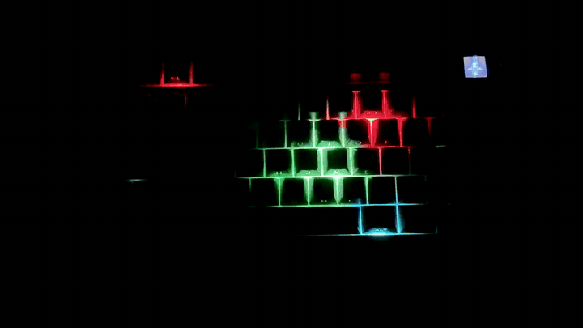
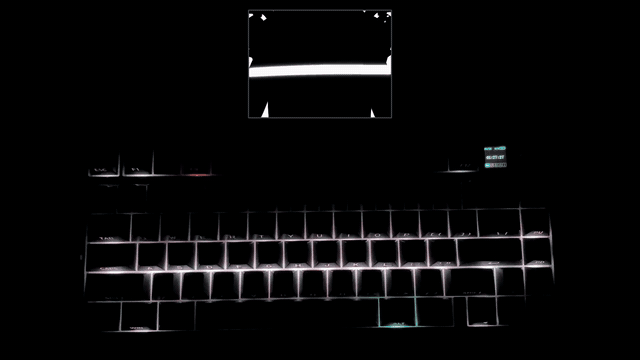

# aula-f75-max-playground

the aula f75 max as an 80-pixel screen. snake on it, bad apple on it.

every key on the board is one pixel the mac can set, 30 times a second, over the usb cable. the board is also the controller, so a game can read the keys it draws on. no vendor software in the loop, nothing on the keyboard modified.

[](https://x.com/jassdotgg/status/2103586627721568336)

snake. the whole board is the field, the arrows steer and are tiles too, the score is the length. [full video](https://x.com/jassdotgg/status/2103586627721568336)

[](https://x.com/jassdotgg/status/2103586399014560076)

bad apple. each key shows the average of its patch of the video, using the key shapes from the vendor's own layout file, so the spacebar is one wide pixel. the audio is the clock. [full video](https://x.com/jassdotgg/status/2103586399014560076)

## run it

you need a mac, the board on a usb-c data cable, and [uv](https://docs.astral.sh/uv/).

```sh
uv sync
uv run keys snake                  # arrows steer. hold esc for a second to quit
uv run keys play some-video.mp4    # any video, synced to its audio
uv run keys rows                   # one colour per row. a quick check that the board answers
uv run keys clock                  # set the board's clock to local time
```

the first run asks for accessibility permission for your terminal. that is the event tap snake uses to read the arrows and keep them from typing into whatever is focused. nothing typed is stored or sent anywhere.

## write your own

a source is a class with four methods. the player does the rest.

```python
import math

class Pulse:
    keys = None  # None, "observe" or "capture"

    def start(self, layout):
        pass

    def on_key(self, key, down):
        pass

    def tick(self, t, dt):
        v = int(127 + 127 * math.sin(t * 3))
        return {"space": (v, 0, v)}  # missing keys are off. None means no change

    def stop(self):
        pass
```

put it in `keys/sources/`, add a line to `keys/cli.py`, run it. `keys/layout.py` has every key's name, led index and physical rectangle, plus `neighbor()` for moving across the board the way the keys are laid out. `snake.py` and `video.py` in `keys/sources/` are the two worked examples.

## what the board does

- it takes a per-key frame over interface 3 as 65-byte feature reports. one frame is a start packet, five data packets, a zero packet and an apply. about 7 ms. `keys/board.py` is the whole transport.
- nothing here writes the board's flash. when frames stop, the firmware fades the last one out and takes the board back within about a minute.
- f3 is a firmware indicator. it blinks red no matter what you send. right alt does not answer to its documented index.
- the board sleeps five minutes after the last physical key press, even wired and mid-stream. the player waits for it and resumes.
- wired only. the 2.4 ghz dongle carries whole-board colour, not per-key.

the protocol was pieced together from three people's work on sibling boards. none of them had an f75 max. `docs/research/aula-f75-max-rgb.md` has the bytes and the citations. `docs/handoff/decision-keys.md` is the working log, including a decision-model idea that is not built yet.

## layout

```
keys/           the player. board, layout, tap, loop, sound, cli
keys/sources/   snake, video, rows
scripts/        f75_probe.py (first contact), find_led.py, demo_video.py
docs/           research note, working log, confirmed led map
tests/          snake rules, video sampling, the loop losing the board
```

## thanks

- [punkster81/AULA-F108-Driver](https://github.com/Punkster81/AULA-F108-Driver) for the per-key stream
- [ghost-cr/F75_Initializer](https://github.com/Ghost-CR/F75_Initializer) for the macos transport and the clock command
- [vitalyart/Aula-F75-Max-Driver](https://github.com/VitalyArt/Aula-F75-Max-Driver) for proving the command channel from a mac

[MIT](LICENSE). Karthickpranav S N (jass).
